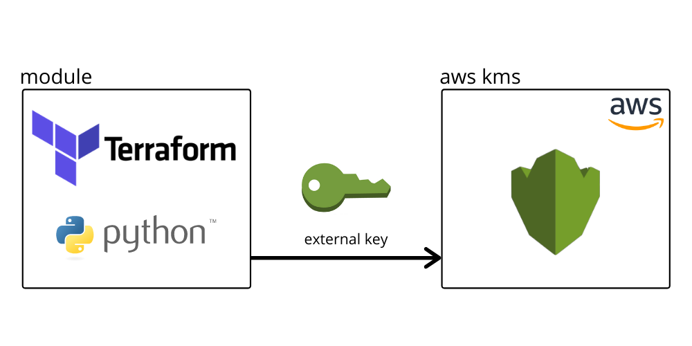

# Bring your own key to AWS KMS



## Requirements

- Python 3.7+ - [link](https://www.python.org/)
- Terraform 0.12+ - [link](https://github.com/hashicorp/terraform)

## Run Terraform module

1. Create virtual enviroment - [link](https://docs.python.org/3/library/venv.html).

2. Run `pip install -r import_key_material/requirements.txt`
3. Clone this repo
4. Run `terrafrom apply`

## Run tests

```sh
./run_unit_tests.sh
```